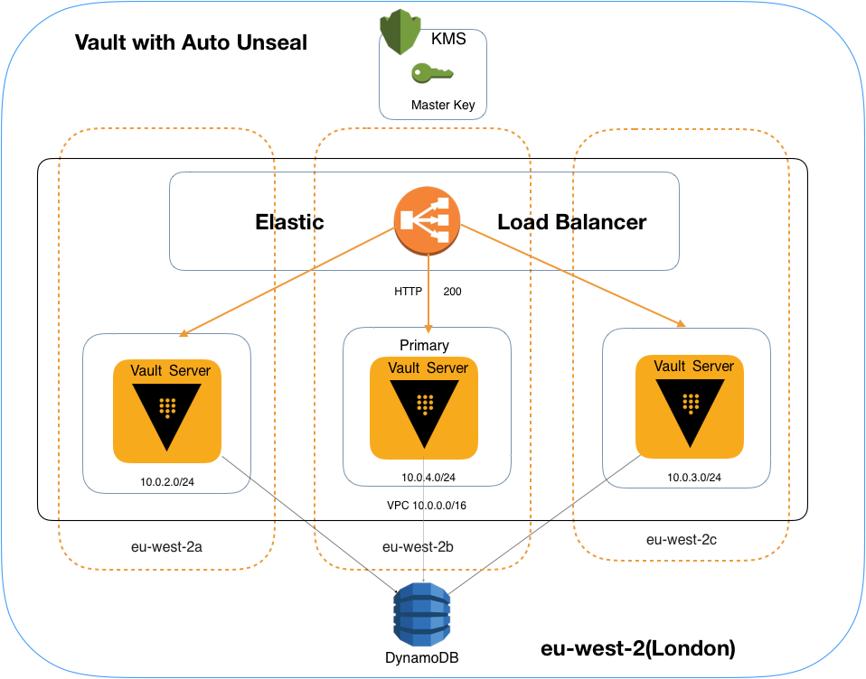

# Hashicorp Vault

### Assume:

Every Micro service deployments needs \
 1.Datasource credentials \
 2.Api keys \
 3.Certificates \
 4.Secret variables which is common/shared across multiple Apps\
 5.URLS \
 6.TOKENS \ 

### Solution:

Vault with persistent storage helps us to achieve this. we can store secrets and credentials ,certificates and retrieve when needed using an API call

#### Proposed solution:

Vault by default uses Shamir shared key algorithm for Master Key which helps to decrypt the Data Encryption Key. (Unsealing process)

Here we are going to use
 
 1.AWS KMS for auto unsealing \
 2.Storage as AWS DynamoDB \
 3.Vault Hosted on EC2 Instances



### Working Flow:

```
KMS --> MasterKey --> Vault (unsealing)

Vault API --> DEK (Barrier) --> DynamoDB (To retrive stored secrets)
```


### Prerequisites for Deployment

```
1. Terraform
2. Valid AWS account with keys and secret
3. Vault Packed AMI or create your own using packer and vault binary

```

### Deploying the Infra Stack

1. Clone this repository 

```
git clone https://github.com/thiru7kavi/Vault-AWS.git
```

2. Navigate to Vault-AWS directory

```
cd Vault-AWS

update variables.tf and environment varibales with AWS account and resource information 

# AWS_ACCESS_KEY_ID
# AWS_SECRET_ACCESS_KEY
# AWS_DEFAULT_REGION
```

3. Build and Deploy the stack

```
terraform init

terraform plan 

trrrafrom apply
```


### Testing the stack

### Maintenance : 

Vault on EC2, we have to consider the below tasks as maintenance activity.

1. Operating system maintenance for Vault nodes\
     a. Filesystem \
     b. Kernel Patch \
     c. Security Patch \
     d. Setup Monitoring
2. Request or Configure or review Periodic backup for DynamoDB tables 
3. Monitoring and alerting on audit metrics using cloud watch or ELK 
4. Audit ACLs and Policies Periodically 
5. Perform manual key rotation if necessary (Master key in KMS)
6. Plan and Handle vault upgrades ,if any bug fixes or security fixes in future
7. Integrate Continuous integration using Jenkins and test vault configs before pushing to Prod
8. DR or Chaos Test to validate High availability


